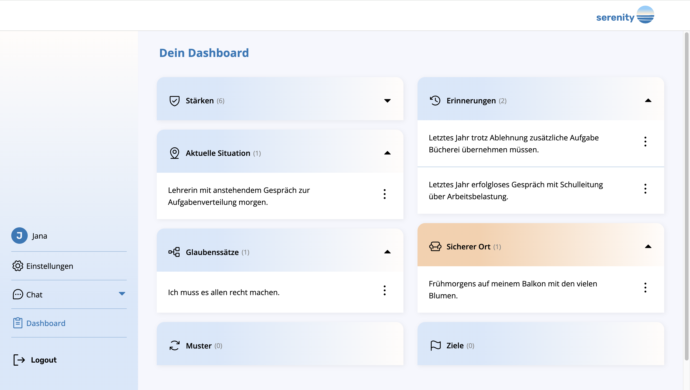

# Katja Röhlig | AI Full-Stack Developer

I build software that brings thoughtful user experiences together with intelligent AI systems. My path started in frontend development and grew into full-stack work with Python, APIs, databases, and applied AI. I enjoy understanding how the pieces fit together—and turning that understanding into useful, approachable products.

This portfolio is both an introduction to my work and a collection of projects I've built and contributed to. I'm currently looking for my next opportunity in AI and full-stack development, and I'd love to connect.

## Featured project: Serenity

**Serenity** is the final project of my eight-month Full-Stack & AI program: an AI-powered application that helps you recognize patterns, believings and strength over time. It combines semantic memory, context retrieval,validation and a multi-agent workflow to build continuous and a reflekting experience.

I built the application from the ground up, spanning its React frontend, FastAPI backend, and memory system. Its core agent manages the conversation, while an archivist agent analyzes it across seven categories and saves useful information for future context.



**Technology:** React, Python, FastAPI, SQLAlchemy, SQLite, ChromaDB, LangChain, LangGraph, OpenAI, Tavily Search, and Langfuse.

[Explore Serenity on GitHub](https://github.com/katja-roehlig/serenity)

## Selected work

### Research and education projects

At the Institute for Applied Informatics (InfAI) in Leipzig, I worked on digital learning platforms focused on data literacy and coding:

- [Toolbox Datenkompetenz](https://beta.toolboxdatenkompetenz.de/) — a platform for learning about data literacy.
- [Coding Labs](https://beta.codinglabs-projekt.de) — an interactive platform for learning to code.

Both projects use technologies including Next.js, Chakra UI, Strapi, Keycloak, and Docker.

### Frontend projects

I also build smaller projects to explore interaction design, responsive interfaces, and practical frontend patterns:

- [Birthday Card](https://birthday-card-1.netlify.app) — an animated digital birthday card built with Vue 3.
- [Tic Tac Toe](https://tictactoe-x.netlify.app) — a game to play solo or with a friend, built with Vue 3.
- [Shopping List](https://shopping-pur.netlify.app) — a lightweight shopping-list app built with TypeScript.

The portfolio's project gallery includes more details, device previews, and links to available source code.

## What you'll find here

- **About:** my development journey, experience at InfAI, and what motivates my work.
- **Skills:** frontend, backend, AI, and design tools I have worked with.
- **Projects:** Serenity, selected learning-platform work, and smaller frontend projects.
- **Contact:** ways to reach me via email, LinkedIn, GitHub, or Xing.

## Technology

The portfolio itself is a single-page application built with **Vue 3**, **TypeScript**, **Vite**, and **Pinia**. It includes responsive layouts, an interactive project gallery with device-size previews, light and dark themes, and section-based navigation.

## Run locally

You'll need **Node.js 20 or later** and npm.

```sh
npm install
npm run dev
```

Vite prints the local development URL in the terminal. To type-check and create a production build:

```sh
npm run build
```

To serve the production build locally:

```sh
npm run preview
```

The Netlify build configuration runs `npm run build` and publishes the `dist` directory.

